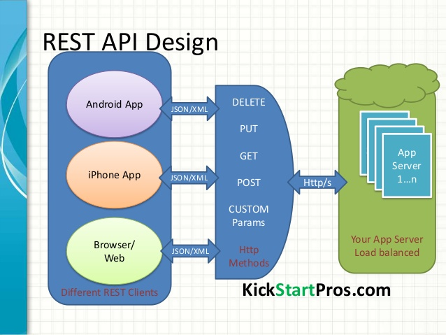
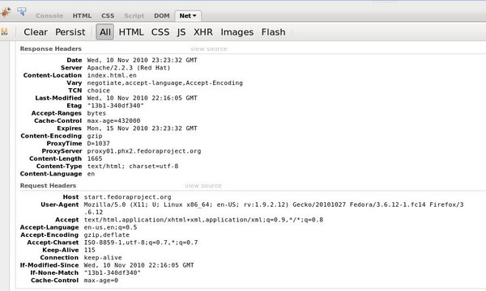
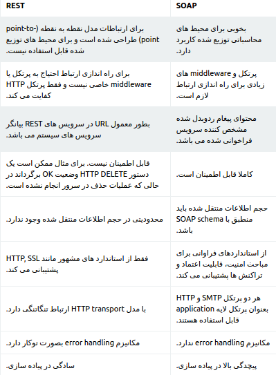
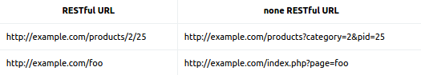

.. _server-overview:

بررسی سرور قسمت ۱ 
===================

در پیاده سازی هسته پروژه با استفاده از زبان برنامه نویسی go و همچنین سعی شده از پروتکل های REST ,SOAP استفاده شود و همچنین فرمت پاسخ دهی به صورت json  است که در ۲ قسمت به صورت تفصیلی توضیح داده شده است

از HTTP و REST چه می دانید ؟
---------------------------

Hypertext Transfer Protocol یا HTTP بخش بزرگی از دنیای وب است، هر دفعه ای که شما یک صفحه ی وب باز میکند یا یک درخواست Ajax ارسال میکنید از HTTP استفاده میکنید اما با این وجود HTTP بین توسعه دهندگان وب تا حدودی ناشناخته است، در این مقاله مجموعه ای از اصول طراحی را که REST شناخته میشود و همچنین اصول دیگری را نیز به تفضیل توضیح خواهیم داد، با مجیدآنلاین در این مقاله همراه باشید.

REST چیست ؟
~~~~~~~~~~~~
REST یک راه ساده برای سازماندهی تعاملات بین سیستم های مستقل است، از سال 2005 محبوبیت پیدا کرد و الهام بخش خدمات طراحی مختلفی مانند Twitter بوده است، این موضوع به این دلیل است که REST به شما اجازه میدهد با کمترین سربار به تعامل بین مشتریان مختلف تلفن همراه و وب بپردازید، در تئوری، REST به وب گره نخورده است، هرجایی که از HTTP بتوان استفاده کرد از REST هم میتوان استفاده کرد و همچنین یادتان باشد REST از HTTP الهام گرفته شده است.

HTTP چیست ؟
~~~~~~~~~~~~~

HTTP یک پروتکل است که اجازه ی ارسال و دریافت داکیومنت ها در وب را میدهد، پروتکل قوانینی برای تبادل اطلاعات بین دو دستگاه در شبکه میباشد، یک پروتکل معروف دیگر پروتکل POP3 میباشد، پروتکلی که ممکن است برای واکشی اطلاعات روی هارد دیسکتان از آن استفاده کنید.

در HTTP دو قانون مختلف داریم : سرور و کلاینت، حقیقتا کلاینت همیشه آغازگر گفت و گو و سرور پاسخ دهنده است، HTTP بر اساس text پایه ریزی شده است، message ها در واقع بیت هایی از text هستند، البته بدنه ی message ها میتواند از مدیاهای دیگر نیز تشکل بشود، اینکه HTTP بر پایه ی text است باعث میشود مانیتور کردن تبادل اطلاعات در HTTP ساده تر شود.

مسیج های HTTP از header و body تشکیل شده اند، body میتواند خالی بماند، body در واقع منبعی برای ذخیره ی اطلاعاتی است که میخواهید این اطلاعات را در فضای شبکه منتقل کنید و این اطلاعات بر اساس دستورالعمل هایی که در header قرار دارد استفاده میشوند، header دارای metadata هست، یعنی یک سری اطلاعات کد شده در آن قرار دارد، اما در درخواست HTTP، محتوای هدر عموما متدهای مهم HTTP است، در حالت REST، داده های header اهمیت بیشتری از body دارند.

HTTP را جاسوسی کنید !
~~~~~~~~~~~~~~~~~~~~

اگر از Developer Tool در کروم و یا Firebug در فایرفاکس استفاده میکنید، بر روی پنل Net کلیک کنید و آن را enable کنید، سپس میتوانید جزئیات اطلاعات HTTP را مشاهده کنید :

برای اینکه با HTTP بیشتر آشنا شوید میتوانید از کلاینت های اختصاصی مانند cURL استفاده کنید، cURL یک ابزار کامند لاینی است که بر روی سیستم عامل های مختلف قابل نصب است، هنگامی که cURL را نصب کنید، با تایپ کردن دستور :

.. code-block:: bash

    curl -v google.com

میتوانید اطلاعات کامل HTTP را مشاهده کنید، درخواست ها با علامت < و پاسخ ها با علامت > نشان داده میشوند.

URL چیست ؟
~~~~~~~~~~~~

URL ها برای شناسایی منابع به کار میروند، هر URL یک منبع مشخص دارد، در واقع صفحه ی وب یک منبع مشخص است و از طریق URL به آن دسترسی پیدا میکنیم، به یک مثال دیگر مراجعه میکنیم، یک برنامه که مدیریت لیست مشتریان یک شرکت را در بر دارد :

.. code-block:: bash
    /clients

ما به تمام کلاینت ها اشاره کردیم

.. code-block:: bash
    /clients/jim

ما به کلاینتی اشاره کردیم که نام "Jim" دارد.

در این مثال ها، hostname را در URL وارد نکرده ایم، hostname به این دلیل مهم است زیرا باید در تمام دنیای وب یکتا و منحصر به فرد باشد، اگر به صورت فنی بگوییم : "شما برای یک host یک request ارسال میکنید تا به resource آن دسترسی پیدا کنید" host به صورت جدا از resource path درون header قرار دارد.

حالا چگونه یک عملیات را مشخص میکنید ؟ برای مثال میخواهید یک رکورد جدید ساخته شود ولی بازیابی نشود ؟ اینجا جایی است که عملیات های مختلف HTTP وارد عمل میشود.

عملیات های مختلف HTTP
~~~~~~~~~~~~~~~~~~~~

هر درخواست HTTP شامل یک سری عملیات خاص HTTP در قسمت header میباشد، به حروف بزرگ کلمه دقت کنید، متد زیر :

.. code-block:: bash
    GET / HTTP/1.1

نشان میدهد که متد مورد استفاده GET است و متد زیر :

.. code-block:: bash
    DELETE /clients/anne HTTP/1.1

نشان میدهد که از متد DELETE استفاده شده است.

به این عملیات مختلف به اصطلاح فنی HTTP verbs گفته میشود، HTTP verb به سرور میگوید که با داده ی شناسایی شده در URL چه کاری انجام دهد. اگر تاکنون با فرم های HTML کار کرده باشید یقینا با دو متد GET و POST آشنایی دارید، اما HTTP verb های بیشتری داریم. از مهم ترین آنها برای ساخت یک RESTful API میتوان GET ، POST ، PUT و DELETE را نام برد. متد های دیگری مانند HEAD و OPTIONS وجود دارد اما کمیاب تر هستند، اگر میخواهید راجع به تمام متدها اطلاعات کسب کنید میتوانید به اینجا مراجعه کنید.

GET
~~~~
GET ساده ترین متد درخواست HTTP است، در این متد از طریق URL اطلاعات را منتقل میکنیم، داده نباید در سمت سرور توسط متد GET دچار تغییر شود، مد GET ، read-only میباشد اما هنگامی که کاربر داده را دریافت میکند میتوانیم هرگونه عملیاتی بر روی آن انجام دهیم، برای مثال فرمت داده را برای نمایش تغییر دهیم.

PUT
~~~~
درخواست PUT زمانی استفاده میشود که میخواهید منبعی که در URL مشخص است را آپدیت کنید یا بسازید، برای مثال :

.. code-block:: bash
    PUT /clients/robin

یک کلاینت به نام Robin در سرور میسازد، در request ما چیزی نیست که به سرور بگوید تا چگونه داده ی مورد نظر ساخته شود، فقط میگوید که ساخته شود، در cURL از طریق request دادن توسط d- میتوانید داده ها را بسازید :

.. code-block:: bash
    curl -v -X PUT -d "some text"

DELETE
~~~~~~~

DELETE برخلاف PUT میباشد، برای زمانی استفاده میشود که میخواهید ریسورسی که توسط URL مشخص میشود را پاک کنید :

.. code-block:: bash
    curl -v -X DELETE /clients/anne

به این طریق تمام داده ها همراه با ریسورس آن پاک میشود، داده ای که در مسیر clients/anne/ می باشد.

POST
~~~~~
POST عموما زمانی استفاده میشود که میخواهیم پردازش سمت سرور تکرار شود، زمانی که فرمی را باMETHOD یا روش POST ارسال می کنید ، در فایل PHP باید داده ای فرم را با متغیر POST دریافت نمائید، زمانی که داده های فرم را با متد POST ارسال می کنید ،  داده هایی که کاربر در فرم وارد کرده در نوار ادرس دیده نمی شود  و همچنین با روش POST محدودیتی در ارسال داده های فرم ندارید، برای ارسال اسم رمز و داده های حساس و مهم از این متد در فرم ها استفاده کنید.

REST API چیست و چگونه کار می کند ؟ 
------------------------------------

REST  یک وب سرویس نیست. پروتکل هم نیست.

REST  یک روش معماریه. یکسری اصول کلی.

به طور کلی :

REST  مخفف Representational State Transfer میباشد یک معماری وب سرویس است که از HTTP برای انتقال اطلاعات میان کلاینت و سرور استفاده میکند کار کردن با REST بسیار ساده تر از وب سرویس های پیچیده ای مانند SOAP میباشد.

یک سرویس به اصطلاح RESTful عموما بر روی پروتکل HTTP  و تمام افعال استاندارد این پروتکل را که توسط مرورگرهای وب قابل درک هستند کار میکند مانند (GET, POST, PUT, DELETE)

معماری REST لازم است شرایط زیر را داشته باشند:

کلاینت سرور (client-server) باشد.

بدون حالت (stateless) باشد.

قابلیت cache داشته باشد.

سیستم لایه‌بندی شده  داشته باشد.

واسط یکنواخت  داشته باشد.

دارای قابلیت کد در صورت نیاز  باشد.

از لحاظ رویکرد برنامه نویسی REST جایگزینی ساده برای سرویس‌های وب است. توسعه‌پذیری در تعاملات میان اجزا، عمومیت واسط ها، توسعه مستقل اجزا و استفاده از واسطه ها  از کلیدی ترین اهداف معماری REST می‌باشد و همچنین استفاده از معماری REST در برنامه‌نویسی کارایی، سادگی، انعطاف‌پذیری، امکان مشاهده و نظارت، قابلیت حمل و قابلیت اطمینان را افزایش می دهد.

 

یک وب سرویس REST دارای مشخصات زیر است :

بوسیله URI کار میکند یعنی ریسورس ها و کالکشن های خود را به صورت http://example.com/resources دریافت میکند

اطلاعات را به صورت عموما JSON دریافت میکند البته میتواند اطلاعات به صورت XML هم برگردانده شود

برخلاف وب سرویس های برپایه SOAP هیچ استاندارد رسمی برای وب سرویس های REST وجود ندارد به دلیل اینکه REST یک معماری است در حالی که SOAP یک پروتکل وب سرویس است.

 

حالا بر طبق این معماری و اصول میتونه سیستمهای مختلفی منجمله وب سرویس طراحی بشه که اونوقت به اون سیستم RESTful گفته میشه.

تفاوت وب سرویس های SOAP و  RESTful چیست؟ 
---------------------------------------------

در نهایت شایان ذکر است روش SOAP بیشتر برای پیاده سازی سرویس های میانی مورد استفاده قرار می گیرد و روش REST بیشتر در مواردی کاربرد دارد که نیازی به سرویس میانی وجود ندارد و اصطلاحا ارتباط point-to-point است.

RESTful یا REST بودن یک وب سایت به چه معناست؟
----------------------------------------------

مفهوم RESTful یا REST فقط مرتبط با وب سایت و web application نیست و یک مدل طراحی معماری برای سیستم های توزیع شده است و به موارد بسیاری مانند  Stateless، web API، web service ، یا وب سایت URL مرتبط است.

مرتبط ترین مبحث RESTful یا REST با وب سایت ها به نظر بنده RESTful URL برای یک سایت است که اگر یک سایت در URL های خود از query string استفاده نکند و فقط منابع سایت را با استفاده از مسیر (path) مشخص کند به URL آن وب سایت RESTful می گویند:

مدل داده JSON
-------------

در مثال قبل ما به دنبال گرفتن اطلاعات صفحه اول دیجی‌کالا بودیم. صفحه اول دیجی‌کالا یک صفحه Html است که توسط مرورگر کروم یا فایرفاکس بایست قابل درک باشد و بتوان شکل درست کالاها، تخفیف‌ها و … را بر روی صفحه نمایش کاربر بکشد. اگر مجدد با پاسخ دیجی‌کالا به درخواست ما مراجعه کنید یکی از هدرهایی که توسط دیجی‌کالا برگردانده شده است به این صورت است:

.. code-block:: bash

    Content-Type: text/html; charset=utf-8

این هدر بیان می‌کند که پاسخ دیجی‌کالا از نوع html است و مرورگر باید پاسخ را تبدیل به المان‌های بصری مانند label، دکمه، منو و … کند.

در صفحات وب، نوع text/html رایج‌ترین نوعی است که مورد استفاده است. اما در دنیای موبایل یا بازی، شما المان‌های بصری را از قبل در جایی مانند Android Studio یا در Unity ساخته‌اید و نیازی به دریافت اطلاعات این المان‌ها از سرور ندارید. برای مثال شما در فایل APK اندروید خود یک XML توصیف از یک Activity را دارید و فقط برخی جاهای خالی در آن وجود دارد. برای مثال فرض کنید Activity شما صفحه پروفایل کاربر می‌باشد. شما تمام المان‌های بصری را در فایل APK خود ساخته‌اید و تنها جای خالی، نام کاربر، عکس پروفایل، سن، جنسیت و … است. بنابر این سرور کافیست همین چند اطلاع ساده را به شما بدهد تا بتوانید فرم خود را تکمیل کنید.

نوع داده‌ی دیگری به جز html وجود دارد که برای سناریوهای موبایل مناسب‌تر است. مدل داده JSON یک استاندارد برای تبدیل اطلاعات به یک رشته قابل خواندن و برعکس است.

مثال ۱

برای مثال فرض کنید میخواهید اطلاعات یک کاربر را که دارای نام و نام خانوادگی است، نمایش دهید. نمایش JSON این اطلاعات به صورت زیر است:

.. code-block:: JSON
    {
    "nam": "ali",
    "name_khanevadegi": "asghari"
    }

در ساختار بالا علامت آکولاد باز “}” و آکولاد بسته “{“ نماد شروع و پایان یک شیء هستند. رشته بالا با آکولاد آغاز می‌شود که نشان می‌دهد کل اطلاعات ما در واقع فقط یک شیء است. درون یک شیء خصوصیات آن با ویرگول از هم جدا شده است. در این مثال، نام کاربر ما “علی” و نام خانوادگی او “اصغری” است.

مثال ۲

فرض کنید کاربر مثال قبلی علاوه بر نام و نام خانوادگی،‌ یک لیست از شماره تلفن‌ها دارد. مقدار JSON آن به صورت زیر خواهد بود:

.. code-block:: JSON
    { 
    "nam": "ali", 
    "name_khanevadegi": "asghari", 
    "telephone": [ "09127673452", "09367651872" ] 
    }   

همانطور که می‌بینید از آنجایی که تلفن یک لیست است، علامت کروشه باز “]” و کروشه بسته “[” نشانگر آرایه است. درون یک آرایه ممکن است مقادیر ساده (مانند شماره تلفن) و یا موجودات پیچیده دیگر وجود داشته باشد. مثال بعدی نمونه‌ای از موجودات پیچیده است.

مثال ۳

فرض کنید بخواهیم در اطلاعات کاربر لیست دارایی‌های او را نشان دهیم. مثالی از JSON مورد نظر به صورت زیر است:

.. code-block:: JSON
    { 
        "nam": "ali", 
        "name_khanevadegi": "asghari", 
        "daraeiha": [ 
            { 
                "onvaan": "tasmim e kobra", 
                "author": "nemidunam!", 
                "type": "book" 
            }, 
            { 
                "onvaan": "Galaxy s7", 
                "weight": "170gr", 
                "type": "SmartPhone" 
            } 
        ] 
    }
همانطور که می‌بینید فیلد دارایی‌های کاربر 

توجه کنید که این ساختار به صورت تو در تو می‌تواند دارای شیء یا آرایه‌های داخلی باشد. مثلا هر کتاب یک آرایه از نویسندگان در داخل خود داشته باشد و باز هر نویسنده یک لیست از کتاب‌های نوشته شده و یا اطلاعات آدرس محل سکونت که خود یک شیئ پیچیده دارای نام شهر، خیابان، کوچه، پلاک و … باشد.

خصوصیات JSON
~~~~~~~~~~~~~

دلیل استفاده فراوان از JSON در سرویس‌های موبایل و تبدیل شدن آن به استاندارد این حوزه عبارتند از:

* سبکی و مختصر بودن JSON و حجم کم داده‌های انتقال داده شده روی شبکه موبایل (3G یا 4G)
* قابل فهم و خوانا بودن
* سادگی در استفاده و کتابخانه‌های فراوانی که برای آن وجود دارد، باعث سرعت در توسعه اپلیکیشن می‌شود. (حتی خودتان هم می‌توانید با صرف کمی وقت یک کتابخانه برای آن بنویسید)

منابع
~~~~

`hami-r.com <http://www.hami-r.com/blog/post/311_REST_API_%DA%86%DB%8C%D8%B3%D8%AA_%D9%88_%DA%86%DA%AF%D9%88%D9%86%D9%87_%DA%A9%D8%A7%D8%B1_%D9%85%DB%8C_%DA%A9%D9%86%D8%AF_%D8%9F/>`_

`javabyab.com <https://javabyab.com/741/%D8%AA%D9%81%D8%A7%D9%88%D8%AA-%D9%88%D8%A8-%D8%B3%D8%B1%D9%88%DB%8C%D8%B3-%D9%87%D8%A7%DB%8C-restful-%D9%88-soap-%D8%AF%D8%B1-%DA%86%DB%8C%D8%B3%D8%AA%D8%9F/>`_

`javabyab.com <https://javabyab.com/4383/restful-%DB%8C%D8%A7-rest-%D8%A8%D9%88%D8%AF%D9%86-%DB%8C%DA%A9-%D9%88%D8%A8-%D8%B3%D8%A7%DB%8C%D8%AA-%D8%A8%D9%87-%DA%86%D9%87-%D9%85%D8%B9%D9%86%D8%A7%D8%B3%D8%AA%D8%9F/>`_

`majidonline.com <http://www.majidonline.com/article/%D8%A7%D8%B2_HTTP_%D9%88_REST_%DA%86%D9%87_%D9%85%DB%8C_%D8%AF%D8%A7%D9%86%DB%8C%D8%AF_%D8%9F.html/>`_

`backtory.com <https://backtory.com/documents/intro/rest.html#نحوه-عملی-ارسال-درخواست/>`_

`image <https://image.slidesharecdn.com/restapidesign-140729104120-phpapp02/95/rest-api-design-8-638.jpg?cb=1406675992/>`_